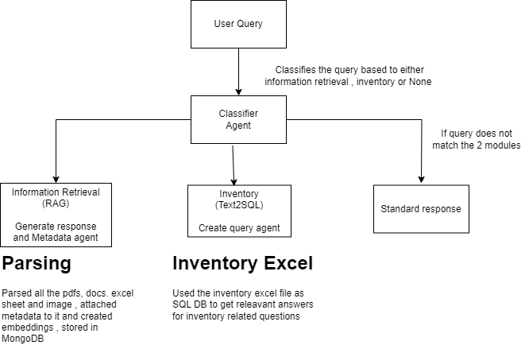

# Real-Estate-Chatbot

This repository contains the architecture and implementation details for a scalable, low-latency real estate chatbot system. The system is designed to handle user queries related to information retrieval, inventory management, and general inquiries with high accuracy and efficiency.

## Architecture Overview

## Scalability and Low Latency Design

To ensure that the system can handle a large number of projects (100+) while maintaining low latency and high accuracy, the following design principles and strategies have been implemented:

### 1. Data Partitioning and Sharding
- **SQL DB Design**: 
  - **Partitioning**: We can store all data related to 100+ projects in an SQL DB for efficient query creation. 

### 2. Caching Mechanisms
- **Query Caching**: Frequently requested queries are stored in a distributed cache (e.g., Redis, Memcached) to reduce database load and response times.
- **Document Caching**: Commonly accessed documents or metadata are cached, minimizing the need for repeated retrieval from MongoDB or other storage.

### 3. Optimized Query Execution
- **Precomputation**: Complex / Simple queries can be precomputed and their results can be stored.

### 4. Enhanced Information Retrieval
- **Vector Embeddings**: Document embeddings are stored in a vector database for efficient similarity searches, including project-specific metadata to narrow down search results quickly.
- **Re-ranking**: A re-ranking mechanism is implemented to prioritize documents based on relevance, using additional project-specific metadata.

### 5. User-Specific Query Optimization
- **Personalized Caching**: Results are cached at a user or project level, ensuring repeated queries benefit from lower latency.

### Other Things to add to reduce latency
- **Load Balancer**
- **Mircoservice architecture**
- **Using Groq**: Groq is used for fast AI inferencing which reduces time for response.

## Software Design Principles

In software development, certain principles stand as the bedrock for writing code that is not only functional but also clean, maintainable, and efficient. Please follow this software Design principles:

1) Keep It Simple, Stupid (KISS)
2) Don't Repeat Yourself (DRY)
3) You Aren't Gonna Need It (YAGNI)
4) Encapsulate What Varies
5) Program to an Interface, Not an Implementation
6) Favor Composition Over Inheritance
7) Strive for Loosely Coupled Designs
8) The Law of Demeter
9) SOLID Principles
  - Single Responsibility Principle (SRP)
  - Open/Closed Principle (OCP)
  - Liskov Substitution Principle (LSP)
  - Interface Segregation Principle (ISP)
  - Dependency Inversion Principle (DIP)

## Techniques used to reduce latency

### Exact Search
Exact search, also known as exact match or precise search, looks for results that perfectly match the given query. It returns only items that have an exact correspondence with the search terms.

### Fuzzy Search
Fuzzy search is a technique that finds approximate matches to search terms. It allows for minor differences or errors in the query, such as misspellings or slight variations, and still returns relevant results.

### Results

#### Time for Retrieval

| Condition | Status | Time | Size |
|-----------|--------|------|------|
| Initial | 200 OK | 8.84 s | 3.51 KB |
| After Exact Query Match Caching | 200 OK | 19 ms | 3.51 KB |
| After Fuzzy Search Caching | 200 OK | 161 ms | 223 B |

#### Time for SQL Query Executor

| Condition | Status | Time | Size |
|-----------|--------|------|------|
| Initial | 200 OK | 3.97 s | 12.59 KB |
| After Exact Query Match Caching | 200 OK | 23 ms | 12.59 KB |
| After Fuzzy Search Caching | 200 OK | 49 ms | 12.59 KB |

Note: There is a flaw in Fuzzy search matching it just mesaures how similar words are not meaning, For example:
"List of properties which are sold" and "List of properties which are not sold" will have same matching

#### Upcoming: Sematic search caching